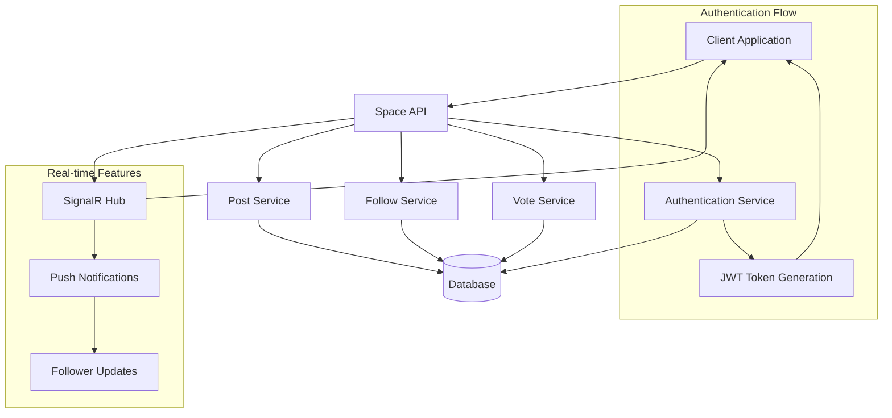
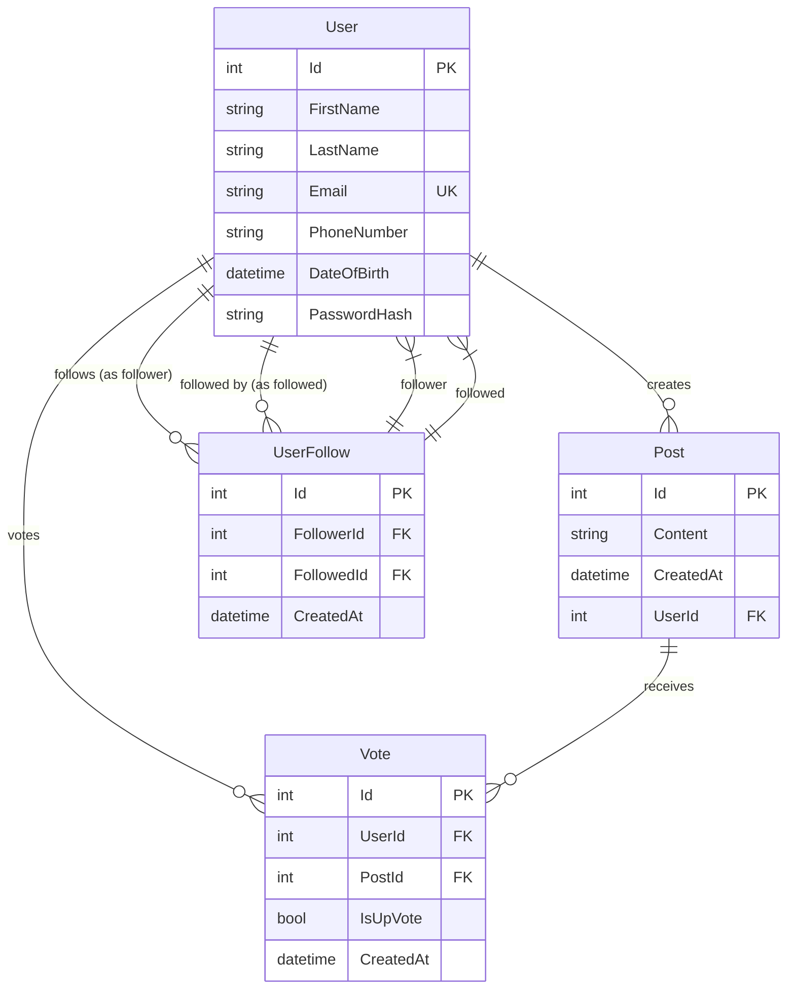

# Space - Social Media Platform

Space is a simple social media platform similar to Reddit with upvote/downvote functionality, but without comments. Users can create posts, vote on them, and follow other users to stay updated with their content.

## Features

- **User Authentication**: Secure JWT-based registration and login
- **Post Creation**: Create and share text-based posts
- **Voting System**: Upvote/downvote posts with real-time score calculation
- **Following System**: Follow up to 50 users to curate your feed
- **Real-time Notifications**: SignalR integration for instant updates
- **Personalized Feed**: See posts from users you follow plus your own content

## System Architecture



## Database Structure



## Technology Stack

- **Backend**: ASP.NET Core Web API
- **Database**: Entity Framework Core with SQL Server
- **Authentication**: JWT (JSON Web Tokens)
- **Real-time Communication**: SignalR
- **Architecture**: Clean Architecture with Repository Pattern

## Getting Started

### Prerequisites
- .NET 8.0 or later
- SQL Server or SQL Server Express
- Visual Studio 2022 or VS Code

### Installation

1. **Clone the repository**
   ```bash
   git clone <repository-url>
   cd space
   ```

2. **Configure Database**
   Update `appsettings.json` with your database connection string:
   ```json
   {
     "ConnectionStrings": {
       "DefaultConnection": "Server=(localdb)\\mssqllocaldb;Database=SpaceDb;Trusted_Connection=true;MultipleActiveResultSets=true"
     }
   }
   ```

3. **Run Migrations**
   ```bash
   dotnet ef database update
   ```

4. **Start the Application**
   ```bash
   dotnet run
   ```

5. **Test the API**
   Navigate to `https://localhost:5001/swagger` to explore the API documentation

## Contributing

1. Fork the repository
2. Create a feature branch (`git checkout -b feature/amazing-feature`)
3. Commit your changes (`git commit -m 'Add some amazing feature'`)
4. Push to the branch (`git push origin feature/amazing-feature`)
5. Open a Pull Request

## License

This project is licensed under the MIT License - see the [LICENSE](LICENSE) file for details.

## Support

If you encounter any issues or have questions, please file an issue on the GitHub repository.